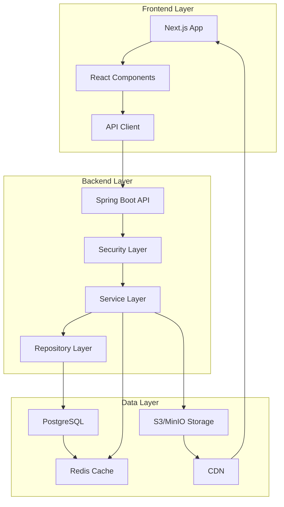

# Design Document

## Overview

The Crashed Car Sales App is a full-stack web application built with modern technologies to provide a scalable, performant marketplace for crashed and used cars. The system follows a microservices-inspired architecture with clear separation between frontend, backend, and data layers.

**Technology Stack:**
- **Frontend:** Next.js 14+ with React 18, TypeScript, Tailwind CSS
- **Backend:** Spring Boot 3.x with Java 17+, Spring Security, Spring Data JPA
- **Database:** PostgreSQL 15+ with Flyway migrations
- **Caching:** Redis for session management and query optimization
- **Storage:** S3/MinIO for image storage with CDN integration
- **Authentication:** JWT tokens with refresh token mechanism
- **Deployment:** Docker containers with Dokploy for local/production environments

## Architecture



## Components and Interfaces

### Frontend Components

#### Core Pages
- **HomePage**: Landing page with featured cars and search interface
- **CarListPage**: Grid/list view with filtering and pagination
- **CarDetailPage**: Comprehensive car information with image gallery
- **DealerDashboard**: Dealer management interface for inventory and statistics
- **AuthPages**: Login, registration, and password recovery

#### Shared Components
- **CarCard**: Reusable car display component for lists and grids
- **SearchFilters**: Advanced filtering interface with real-time updates
- **ImageGallery**: Responsive image viewer with zoom and navigation
- **Navigation**: Header with authentication state and language switcher
- **Footer**: Links, contact information, and language selection

#### API Integration
```typescript
// API Client Interface
interface ApiClient {
  cars: {
    getAll(filters?: CarFilters): Promise<PaginatedResponse<Car>>;
    getById(id: string): Promise<Car>;
    create(car: CreateCarRequest): Promise<Car>;
    update(id: string, car: UpdateCarRequest): Promise<Car>;
    delete(id: string): Promise<void>;
  };
  dealers: {
    register(dealer: DealerRegistration): Promise<Dealer>;
    getProfile(): Promise<Dealer>;
    updateProfile(dealer: UpdateDealerRequest): Promise<Dealer>;
  };
  auth: {
    login(credentials: LoginRequest): Promise<AuthResponse>;
    refresh(token: string): Promise<AuthResponse>;
    logout(): Promise<void>;
  };
}
```

### Backend Services

#### Authentication Service
- JWT token generation and validation
- Role-based access control (ADMIN, DEALER, BUYER)
- Password encryption with BCrypt
- Refresh token mechanism for security

#### Car Service
- CRUD operations for car listings
- Advanced search with Elasticsearch-style filtering
- Image upload coordination with storage service
- Similar car recommendation algorithm

#### Dealer Service
- Dealer registration and profile management
- Dashboard statistics calculation
- Notification preferences management

#### Notification Service
- Email notifications for buyer interest
- Template-based messaging system
- Queue-based processing for scalability

#### Storage Service
- S3/MinIO integration for image uploads
- CDN URL generation
- Image optimization and resizing
- Cleanup of orphaned files

### REST API Endpoints

```yaml
# Authentication
POST /api/auth/login
POST /api/auth/register
POST /api/auth/refresh
POST /api/auth/logout

# Cars
GET /api/cars?filters={}&page={}&size={}
GET /api/cars/{id}
POST /api/cars
PUT /api/cars/{id}
DELETE /api/cars/{id}
GET /api/cars/{id}/similar

# Dealers
GET /api/dealers/profile
PUT /api/dealers/profile
GET /api/dealers/{id}/cars
GET /api/dealers/dashboard/stats

# Images
POST /api/images/upload
DELETE /api/images/{id}

# Favorites
GET /api/favorites
POST /api/favorites/{carId}
DELETE /api/favorites/{carId}

# Admin
GET /api/admin/users
PUT /api/admin/users/{id}/status
GET /api/admin/statistics
```

## Data Models

### Database Schema

```sql
-- Users table (polymorphic for dealers, buyers, admins)
CREATE TABLE users (
    id UUID PRIMARY KEY DEFAULT gen_random_uuid(),
    email VARCHAR(255) UNIQUE NOT NULL,
    password_hash VARCHAR(255) NOT NULL,
    role VARCHAR(20) NOT NULL CHECK (role IN ('ADMIN', 'DEALER', 'BUYER')),
    created_at TIMESTAMP DEFAULT CURRENT_TIMESTAMP,
    updated_at TIMESTAMP DEFAULT CURRENT_TIMESTAMP,
    is_active BOOLEAN DEFAULT true
);

-- Dealers table (extends users)
CREATE TABLE dealers (
    id UUID PRIMARY KEY DEFAULT gen_random_uuid(),
    user_id UUID REFERENCES users(id) ON DELETE CASCADE,
    name VARCHAR(255) NOT NULL,
    address TEXT,
    phone VARCHAR(50),
    website VARCHAR(255),
    created_at TIMESTAMP DEFAULT CURRENT_TIMESTAMP,
    updated_at TIMESTAMP DEFAULT CURRENT_TIMESTAMP
);

-- Cars table
CREATE TABLE cars (
    id UUID PRIMARY KEY DEFAULT gen_random_uuid(),
    dealer_id UUID REFERENCES dealers(id) ON DELETE CASCADE,
    make VARCHAR(100) NOT NULL,
    model VARCHAR(100) NOT NULL,
    year INTEGER NOT NULL,
    fuel_type VARCHAR(20) NOT NULL CHECK (fuel_type IN ('GAS', 'HYBRID', 'DIESEL', 'ELECTRIC')),
    transmission VARCHAR(20) NOT NULL CHECK (transmission IN ('MANUAL', 'AUTOMATIC', 'CVT')),
    vehicle_type VARCHAR(20) NOT NULL CHECK (vehicle_type IN ('VAN', 'MOTOR', 'PASSENGER', 'TRUCK')),
    condition VARCHAR(20) NOT NULL CHECK (condition IN ('DAMAGED', 'USED', 'ACCIDENTED', 'DERELICT')),
    price DECIMAL(10,2) NOT NULL,
    mileage INTEGER,
    description TEXT,
    is_featured BOOLEAN DEFAULT false,
    is_active BOOLEAN DEFAULT true,
    created_at TIMESTAMP DEFAULT CURRENT_TIMESTAMP,
    updated_at TIMESTAMP DEFAULT CURRENT_TIMESTAMP
);

-- Car images table
CREATE TABLE car_images (
    id UUID PRIMARY KEY DEFAULT gen_random_uuid(),
    car_id UUID REFERENCES cars(id) ON DELETE CASCADE,
    image_url VARCHAR(500) NOT NULL,
    alt_text VARCHAR(255),
    display_order INTEGER DEFAULT 0,
    created_at TIMESTAMP DEFAULT CURRENT_TIMESTAMP
);

-- Car features table
CREATE TABLE car_features (
    id UUID PRIMARY KEY DEFAULT gen_random_uuid(),
    car_id UUID REFERENCES cars(id) ON DELETE CASCADE,
    airbags BOOLEAN DEFAULT false,
    abs_brakes BOOLEAN DEFAULT false,
    air_conditioning BOOLEAN DEFAULT false,
    power_steering BOOLEAN DEFAULT false,
    central_locking BOOLEAN DEFAULT false,
    electric_windows BOOLEAN DEFAULT false,
    created_at TIMESTAMP DEFAULT CURRENT_TIMESTAMP
);

-- Sales table
CREATE TABLE sales (
    id UUID PRIMARY KEY DEFAULT gen_random_uuid(),
    car_id UUID REFERENCES cars(id),
    buyer_id UUID REFERENCES users(id),
    sale_price DECIMAL(10,2) NOT NULL,
    sale_date TIMESTAMP DEFAULT CURRENT_TIMESTAMP,
    status VARCHAR(20) DEFAULT 'COMPLETED' CHECK (status IN ('PENDING', 'COMPLETED', 'CANCELLED'))
);

-- Favorites table
CREATE TABLE favorites (
    id UUID PRIMARY KEY DEFAULT gen_random_uuid(),
    user_id UUID REFERENCES users(id) ON DELETE CASCADE,
    car_id UUID REFERENCES cars(id) ON DELETE CASCADE,
    created_at TIMESTAMP DEFAULT CURRENT_TIMESTAMP,
    UNIQUE(user_id, car_id)
);

-- Indexes for performance
CREATE INDEX idx_cars_make_model ON cars(make, model);
CREATE INDEX idx_cars_price ON cars(price);
CREATE INDEX idx_cars_condition ON cars(condition);
CREATE INDEX idx_cars_dealer_id ON cars(dealer_id);
CREATE INDEX idx_cars_created_at ON cars(created_at);
CREATE INDEX idx_car_images_car_id ON car_images(car_id);
CREATE INDEX idx_favorites_user_id ON favorites(user_id);
```

### TypeScript Interfaces

```typescript
interface User {
  id: string;
  email: string;
  role: 'ADMIN' | 'DEALER' | 'BUYER';
  createdAt: Date;
  isActive: boolean;
}

interface Dealer extends User {
  name: string;
  address?: string;
  phone?: string;
  website?: string;
}

interface Car {
  id: string;
  dealerId: string;
  make: string;
  model: string;
  year: number;
  fuelType: 'GAS' | 'HYBRID' | 'DIESEL' | 'ELECTRIC';
  transmission: 'MANUAL' | 'AUTOMATIC' | 'CVT';
  vehicleType: 'VAN' | 'MOTOR' | 'PASSENGER' | 'TRUCK';
  condition: 'DAMAGED' | 'USED' | 'ACCIDENTED' | 'DERELICT';
  price: number;
  mileage?: number;
  description?: string;
  images: CarImage[];
  features: CarFeatures;
  isFeatured: boolean;
  isActive: boolean;
  createdAt: Date;
  dealer: Dealer;
}

interface CarFeatures {
  airbags: boolean;
  absBrakes: boolean;
  airConditioning: boolean;
  powerSteering: boolean;
  centralLocking: boolean;
  electricWindows: boolean;
}
```

## Error Handling

### Frontend Error Handling
- Global error boundary for React components
- API error interceptors with user-friendly messages
- Form validation with real-time feedback
- Network error detection and retry mechanisms
- Loading states and skeleton components

### Backend Error Handling
- Global exception handler with standardized error responses
- Validation error mapping to field-specific messages
- Security error handling without information leakage
- Database constraint violation handling
- File upload error management

### Error Response Format
```json
{
  "error": {
    "code": "VALIDATION_ERROR",
    "message": "Invalid input data",
    "details": [
      {
        "field": "email",
        "message": "Email format is invalid"
      }
    ],
    "timestamp": "2024-02-10T10:30:00Z"
  }
}
```

## Testing Strategy

### Frontend Testing
- **Unit Tests:** Jest + React Testing Library for components
- **Integration Tests:** API integration with MSW (Mock Service Worker)
- **E2E Tests:** Playwright for critical user journeys
- **Visual Tests:** Chromatic for UI regression testing

### Backend Testing
- **Unit Tests:** JUnit 5 + Mockito for service layer
- **Integration Tests:** Spring Boot Test with TestContainers
- **API Tests:** RestAssured for endpoint testing
- **Performance Tests:** JMeter for load testing

### Database Testing
- **Migration Tests:** Flyway validation in CI/CD
- **Data Integrity Tests:** Constraint and relationship validation
- **Performance Tests:** Query optimization validation

### Test Coverage Goals
- Frontend: 80% code coverage
- Backend: 85% code coverage
- Critical paths: 95% coverage (authentication, payments, data integrity)

## Performance Optimization

### Caching Strategy
- **Redis Cache:** Search results, user sessions, frequently accessed data
- **CDN:** Static assets, images, and public content
- **Browser Cache:** Optimized cache headers for static resources
- **Database Query Cache:** Hibernate second-level cache for read-heavy operations

### Image Optimization
- **Multiple Formats:** WebP, AVIF with fallbacks
- **Responsive Images:** Multiple sizes for different screen resolutions
- **Lazy Loading:** Progressive image loading for better perceived performance
- **Compression:** Automatic image optimization on upload

### Database Optimization
- **Indexing Strategy:** Composite indexes for common query patterns
- **Query Optimization:** N+1 query prevention with proper joins
- **Connection Pooling:** HikariCP for efficient database connections
- **Read Replicas:** Separate read/write operations for scalability

## Security Considerations

### Authentication & Authorization
- JWT tokens with short expiration and refresh mechanism
- Role-based access control with method-level security
- Password strength requirements and secure hashing
- Account lockout after failed login attempts

### Data Protection
- Input validation and sanitization
- SQL injection prevention with parameterized queries
- XSS protection with Content Security Policy
- CSRF protection with Spring Security

### File Upload Security
- File type validation and virus scanning
- Size limits and rate limiting
- Secure file storage with access controls
- Image metadata stripping for privacy

## Internationalization

### Multi-language Support
- **Frontend:** Next.js i18n with react-i18next
- **Backend:** Spring Boot MessageSource for API responses
- **Database:** Separate translation tables for dynamic content
- **Supported Languages:** English (EN), Spanish (ES)

### Localization Features
- Currency formatting based on locale
- Date and time formatting
- Number formatting (decimal separators, thousands)
- Right-to-left language support preparation