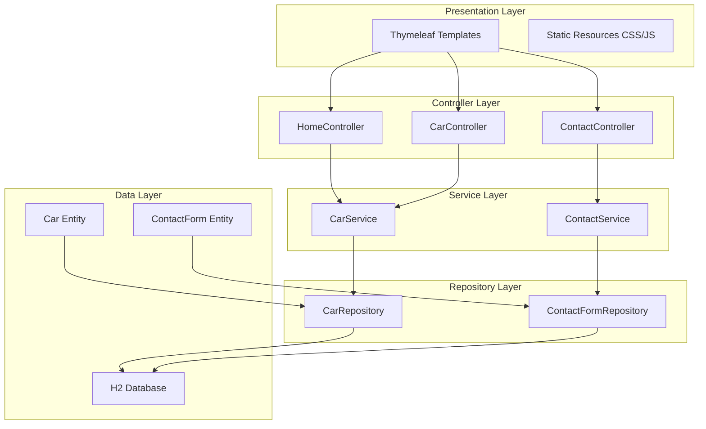
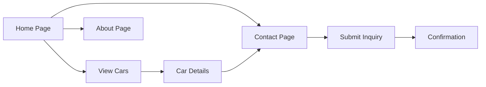

# Car Dealer Website - Architecture Plan

## Project Overview
A simple Spring Boot web application for a car dealership with basic features including car inventory display, contact form, and informational pages.

## Technology Stack

### Backend
- **Framework**: Spring Boot 3.x
- **Language**: Java 17+
- **Build Tool**: Maven
- **Database**: H2 (in-memory)
- **ORM**: Spring Data JPA
- **Template Engine**: Thymeleaf
- **Validation**: Spring Boot Validation (Hibernate Validator)

### Frontend
- **Template Engine**: Thymeleaf
- **CSS Framework**: Bootstrap 5
- **Icons**: Bootstrap Icons
- **JavaScript**: Vanilla JS (minimal)

## Project Structure

```
springboot/
├── src/
│   ├── main/
│   │   ├── java/
│   │   │   └── com/
│   │   │       └── cardealer/
│   │   │           ├── CarDealerApplication.java
│   │   │           ├── controller/
│   │   │           │   ├── HomeController.java
│   │   │           │   ├── CarController.java
│   │   │           │   └── ContactController.java
│   │   │           ├── model/
│   │   │           │   ├── Car.java
│   │   │           │   └── ContactForm.java
│   │   │           ├── repository/
│   │   │           │   ├── CarRepository.java
│   │   │           │   └── ContactFormRepository.java
│   │   │           └── service/
│   │   │               ├── CarService.java
│   │   │               └── ContactService.java
│   │   └── resources/
│   │       ├── application.properties
│   │       ├── data.sql
│   │       ├── static/
│   │       │   ├── css/
│   │       │   │   └── style.css
│   │       │   ├── js/
│   │       │   │   └── main.js
│   │       │   └── images/
│   │       └── templates/
│   │           ├── fragments/
│   │           │   ├── header.html
│   │           │   └── footer.html
│   │           ├── index.html
│   │           ├── cars.html
│   │           ├── car-detail.html
│   │           ├── contact.html
│   │           ├── about.html
│   │           └── error.html
│   └── test/
│       └── java/
│           └── com/
│               └── cardealer/
│                   └── CarDealerApplicationTests.java
├── pom.xml
└── README.md
```

## Architecture Diagram



## Data Model

### Car Entity
```
Car
├── id: Long (Primary Key, Auto-generated)
├── make: String (e.g., Toyota, Honda)
├── model: String (e.g., Camry, Accord)
├── year: Integer (e.g., 2023)
├── price: BigDecimal (e.g., 25000.00)
├── mileage: Integer (e.g., 15000)
├── color: String (e.g., Red, Blue)
├── description: String (Text)
├── imageUrl: String (URL to car image)
└── createdAt: LocalDateTime
```

### ContactForm Entity
```
ContactForm
├── id: Long (Primary Key, Auto-generated)
├── name: String (Required)
├── email: String (Required, Valid email)
├── phone: String (Optional)
├── message: String (Required)
└── submittedAt: LocalDateTime
```

## Application Flow

### User Journey Flow


## Page Descriptions

### 1. Home Page (index.html)
- Hero section with dealership branding
- Featured cars carousel/grid (3-4 cars)
- Call-to-action buttons
- Quick stats (total cars, years in business, etc.)
- Navigation to other pages

### 2. Cars Inventory Page (cars.html)
- Grid/list view of all available cars
- Each car card shows: image, make/model, year, price, mileage
- Click on card to view details
- Simple filtering options (optional for future enhancement)

### 3. Car Detail Page (car-detail.html)
- Large car image
- Complete car specifications
- Price and mileage prominently displayed
- Description
- Contact button linking to contact form

### 4. Contact Page (contact.html)
- Contact form with fields: name, email, phone, message
- Form validation
- Dealership contact information
- Location map (optional)
- Success message after submission

### 5. About Page (about.html)
- Dealership history and mission
- Team information (optional)
- Why choose us section
- Customer testimonials (optional)

## Key Features

### 1. Car Inventory Management
- Display all cars in database
- View individual car details
- Pre-populated sample data for demonstration

### 2. Contact Form
- Capture customer inquiries
- Store in database
- Form validation (required fields, email format)
- Success confirmation

### 3. Responsive Design
- Mobile-first approach using Bootstrap
- Works on desktop, tablet, and mobile devices

### 4. Navigation
- Consistent header with navigation menu
- Footer with additional links and information

## Configuration

### Application Properties
```properties
# Server Configuration
server.port=8080

# H2 Database Configuration
spring.datasource.url=jdbc:h2:mem:cardealer
spring.datasource.driverClassName=org.h2.Driver
spring.datasource.username=sa
spring.datasource.password=

# JPA Configuration
spring.jpa.database-platform=org.hibernate.dialect.H2Dialect
spring.jpa.hibernate.ddl-auto=create-drop
spring.jpa.show-sql=true

# H2 Console (for development)
spring.h2.console.enabled=true
spring.h2.console.path=/h2-console

# Thymeleaf Configuration
spring.thymeleaf.cache=false
```

## Dependencies (pom.xml)

### Core Dependencies
- spring-boot-starter-web
- spring-boot-starter-data-jpa
- spring-boot-starter-thymeleaf
- spring-boot-starter-validation
- h2
- lombok (optional, for reducing boilerplate)
- spring-boot-devtools (for development)

## Security Considerations

For this basic version:
- No authentication/authorization required
- Contact form has basic validation
- SQL injection prevented by JPA/Hibernate
- XSS protection via Thymeleaf escaping

Future enhancements could include:
- Admin panel with Spring Security
- CSRF protection for forms
- Rate limiting on contact form

## Testing Strategy

### Unit Tests
- Service layer business logic
- Repository queries

### Integration Tests
- Controller endpoints
- Database operations

### Manual Testing
- UI/UX testing
- Form validation
- Responsive design testing

## Deployment

### Local Development
```bash
mvn spring-boot:run
```
Access at: http://localhost:8080

### H2 Console
Access at: http://localhost:8080/h2-console
- JDBC URL: jdbc:h2:mem:cardealer
- Username: sa
- Password: (empty)

## Future Enhancements

1. **Search and Filter**
   - Search by make, model, price range
   - Advanced filtering options

2. **Admin Panel**
   - Add/Edit/Delete cars
   - View contact form submissions
   - User authentication

3. **Image Upload**
   - Upload car images
   - Multiple images per car

4. **Email Notifications**
   - Send email on contact form submission
   - Email templates

5. **Favorites/Wishlist**
   - Allow users to save favorite cars
   - Session-based or user account-based

6. **Appointment Scheduling**
   - Book test drives
   - Schedule viewings

7. **Production Database**
   - Switch from H2 to PostgreSQL/MySQL
   - Database migration scripts

## Development Timeline

Estimated time: 4-6 hours for basic implementation

1. **Setup (30 min)**: Project structure, dependencies
2. **Backend (2 hours)**: Entities, repositories, services, controllers
3. **Frontend (2 hours)**: Thymeleaf templates, styling
4. **Testing (1 hour)**: Manual testing, bug fixes
5. **Documentation (30 min)**: README, comments

## Success Criteria

- ✅ Application runs without errors
- ✅ All pages are accessible and functional
- ✅ Car inventory displays correctly
- ✅ Contact form submits and stores data
- ✅ Responsive design works on mobile and desktop
- ✅ Sample data loads on startup
- ✅ Navigation works between all pages
- ✅ Form validation works properly

## Notes

- This is a development-ready application using H2 in-memory database
- Data will be reset on application restart
- For production, switch to persistent database
- Images can be stored as URLs initially (external links)
- Bootstrap CDN used for quick setup